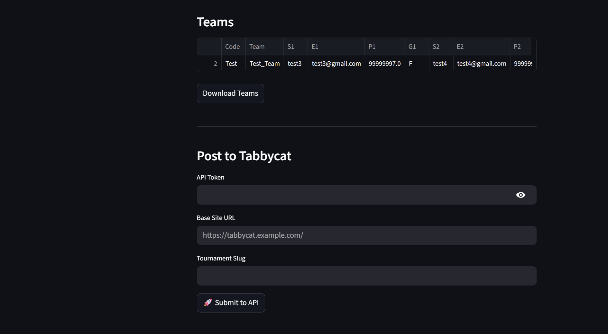

# 🏛️ Tabbycat Data Uploader via Streamlit

This Streamlit app enables tournament organizers to easily upload data for Institutions, Judges, and Teams to a Tabbycat instance via API calls.

---

## 📂 What It Does

- Uploads data from an Excel file with three sheets: **Institutions**, **Judges**, and **Teams**
- Normalizes gender values (`Male`, `Female`, `Prefer Not To Say`, etc.)
- Automatically handles institution linking
- Sends POST requests to the Tabbycat API for:
  - Institutions
  - Judges
  - Teams (with speaker data)

---

## 📁 Excel Sheet Format

### Sheet: `Institutions`

| name           | short |
|----------------|-------|
| Oxford Union   | OU    |
| Cambridge A    | CA    |

---

### Sheet: `Judges`

| name         | institution   | gender              | pronoun | email               | phone       |
|--------------|---------------|---------------------|---------|---------------------|-------------|
| Alice Roy    | Oxford Union  | Female              | she/her | alice@example.com   | 1234567890  |
| Bob Smith    | Cambridge A   | Prefer Not To Say   |         | bob@example.com     | 0987654321  |

> **Note:**  
> - Gender values are normalized to:
>   - `Male` → `M`  
>   - `Female` → `F`  
>   - `Prefer Not To Say` → (blank)  
>   - Any other value → `O` (Other)

---

### Sheet: `Teams`

| name      | speaker1     | speaker1_gender | speaker2     | speaker2_gender | institution   |
|-----------|--------------|-----------------|--------------|-----------------|---------------|
| Oxford A  | Alice Roy    | Female          | Bob Smith    | Prefer Not To Say | Oxford Union |

---

## 🔧 Required Inputs (Inside App)

- **Tabbycat Token**
- **Site URL** (e.g., `https://mytabbycat.com`)
- **Slug** (e.g., `intervarsity2025`)
- **Excel File** (must contain sheets: `Institutions`, `Judges`, `Teams`)

---

## ▶️ Running the App

### Step 1: Install dependencies

```bash
git clone https://github.com/pranjal-singla/tab_importer_streamlit
python -m venv venv
source venv/bin/activate  # Windows: venv\Scripts\activate
pip install -r requirements.txt
streamlit run app.py

## 🖼️ Screenshot


